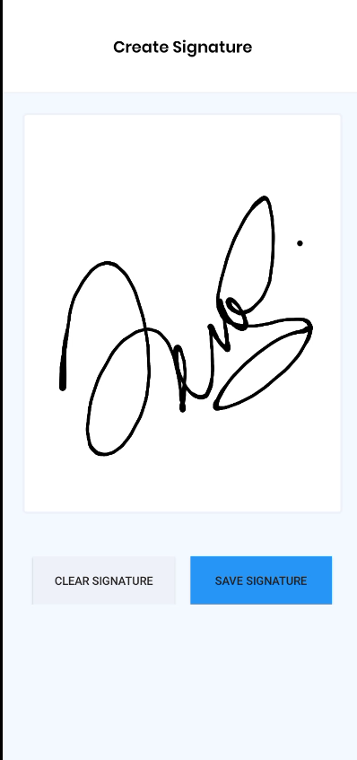

# Signature Pad (Experiment Apps)

## Prerequiste

- [Kotlin](https://kotlinlang.org//)
- Android Studio

## Stacks

- Kotlin
- gcacace:signature-pad

(Running inside Container)

## Installation

1. Clone repository

```bash
$  git clone git remote add origin https://github.com/Zainal21/signature-pad.git
```

2. open your android studio and run

## Example Result

- Splash Screen


- Sign Pad



Copyright © 2022 by Muhamad Zainal Arifin

> The Project is Under MIT licensed.
